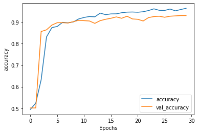
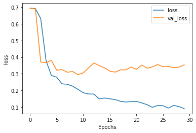

# Laporan Project Machine Learning - Gufranaka Samudra
## Fake Or Real News (NLP)
## Project Preview
Belakangan ini banyak sekali penyebaran informasi atau berita hoak di internet. Dampaknya, masyarakat akan merasa yakin bahwa konten tersebut benar tanpa ada unsur kebohongan sama sekali. Selain itu, dampak lain dari hoax adalah bisa merugikan emosi hingga finansial masyarakat. Dikutip dari laman Psychology Today, target dari penyebaran hoax ini adalah emosi mereka yang membacanya.

Jadi pada kasus kali ini kita akan membuat model untuk mendeteksi apakah suatu berita Real/Fake. Dengan adanya ini kita bisa memfilter mana berita yang hoak dan berita yang real, sehingga informasi yang di konsumsi oleh pengguna internet adalah berita yang asli/real.

* Project ini membantu pengguna internet untuk mendapati berita yang Asli, bukan Hoax.
* Membuat internet menjadi lebih bersih dari berita-berita Hoax.
* Sumber Referensi: [Kaggle](https://www.kaggle.com/datasets/jillanisofttech/fake-or-real-news)

## Business Understanding
Kita akan membangun model Machine Learning untuk memprediksi apakah suatu berita itu Hoax atau bukan, dan memberikan informasi yang bersih dari Hoax.

### Problem Statement
* Bagaimana cara mengatasi data text untuk Machine Learning?
* Bagaimana melakukan Proses NLP di Machine Learning untuk mengatasi problem?
  
### Goals
* Mengubah data text menjadi numerik agar mesin dapan memproses data tersebut.
* Melakukan Proses NLP Machine Learning dengan cepat dan mudah.

### Solution Statements
* Untuk melakukan tersebut menggunakan teknik Tokenize, Sequence, Padding, di bantu dengan Library Tensorflow untuk melakukan hal tersebut.
* Untuk mencapai itu, saya menggunakan Library Tensorflow untuk memudahkan proses pembuatan model Machine Learning NLP.

6335 rows × 4 columns

## Data Understanding
Dataset fake_or_real_news adalah dataset macam-macam berita yang berisi `6335` baris dengan `4` kolom, dataset di unduh dari website Kaggle. Tools yang akan kita gunakan adalah dengan Visual Studio Code, bisa juga dengan Jupyter Notebook.

### variable-variable pada dataset fake_or_real_news
* ***number*** : Hanya berisi nomor random.
* ***title*** : Judul dari berita.
* ***text*** : Isi dari seluruh berita.
* ***label*** : label FAKE or REAL.

## Data Preparation
Ada beberapa tahap yang akan kita lakukan terhadap dataset yang kita miliki, seperti sebagai berikut,

* Stopword.
* Labeling untuk kolom label.
* Split data ke data latih dan uji
* Tokenize
* Sequence and Padding

### Data Cleaning
***Stopword***  
Kita akan membersihkan data kita dari kata-kata yang mengandung sedikit makna seperti is, a, the, dll. Tujuan utama dalam penerapan proses stopwords ini adalah mengurangi jumlah kata dalam sebuah dokumen yang nantinya akan berpengaruh dalam kecepatan dan performa NLP.

***Labeling*** 
Karena data label kita berupa string, maka kita harus mengubahnya menjadi numeric agar bisa di proses oleh mesin.

***Split Data Training and Test set*** 
Kita juga harus membagi data kita menjadi data latih dan uji, dengan tujuan data uji tidak di kenali oleh data latih, agar data latih fokus untuk proses training. Dan menjadikan data uji sebagai data baru.

***Tokenize*** 
Mesin tidak bisa membaca data string/text, oleh karena itu proses Tokenize di perlukan untuk mengubah setiap kata menjadi numeric.

***Sequence and Padding*** 
Sequence : Merupakan kumpulan larik angka dari beberapa kata. 
Padding : proses untuk membuat setiap kalimat pada teks memiliki panjang yang seragam.

## Modelling & Results
Kita akan menggunakan Tensorflow Neural Network untuk melatih data kita. Dengan memanfaatkan Sequential kita dengan mudah akan mengatur Embedding, dan layar Dense, kita juga menggunakan GlobalAverangePooling1D.

## Evaluasi
Pada proses tersebut kita mendapatkan akurasi yang cukup bagus yaitu sebesar `96%` dan validasi akurasi sebesar `93%`. Berikut hasil dari visualisasi nya,

 

***Akurasi*** 

 

***Loss*** 

Kita juga melakukan testing dari data test kita terhadap hasil model untuk memastikan bahwa hasil training kita bekerja.  
Ingat sebelumnya: 
* REAL : 1
* FAKE : 0

Jika kita perhatikan: 
Label Aktual   : [0, 1, 1, 0, 0] 
Label Prediksi : [1, 1, 1, 0, 0]

prediksi kita sebagian besar benar, dan hanya satu yang memiliki kesalahan prediksi, yaitu pada index `10` yang di mana nilai sebenarnya adalah `0(FAKE)` tapi program kita memprediksi itu adalah `1(REAL)`.